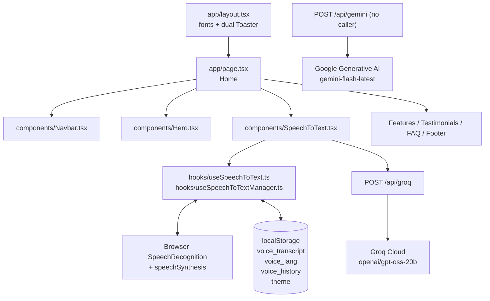
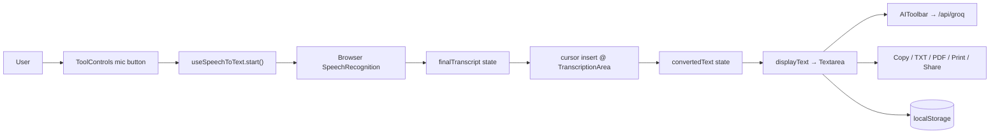
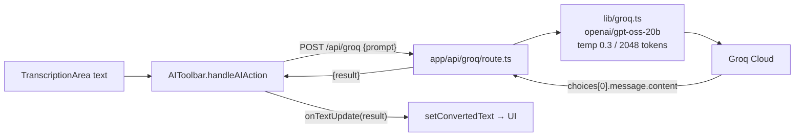

# VoiceFlow — Professional Speech-to-Text Platform

> Transform your voice into flawless text instantly with browser-native dictation + AI post-processing.

VoiceFlow is a single-route Next.js 15 App Router application: a marketing landing page with an embedded speech-to-text workbench. Users dictate via the browser Web Speech API, edit in a rich textarea, enhance text with Groq AI, and export locally (TXT / PDF / Print / Share). There is no login, no database, and no cloud sync — persistence is `localStorage` only.

## Overview

- **Route:** `/` (`app/page.tsx:9-28`) composes `Navbar`, `Hero`, `SpeechToText`, `Features`, `Testimonials`, `FAQ`, `Footer`.
- **Core tool:** `components/SpeechToText.tsx` orchestrates 13 sub-components in `components/speech-to-text/`.
- **Speech:** browser `SpeechRecognition` / `webkitSpeechRecognition` via `hooks/useSpeechToText.ts`, managed by `hooks/useSpeechToTextManager.ts`.
- **AI:** live proxy `POST /api/groq` → `lib/groq.ts` → Groq Cloud. Dormant proxy `POST /api/gemini` → `lib/gemini.ts` (no UI caller).
- **Type:** TypeScript `strict`, Tailwind CSS 4 (CSS-first), shadcn/ui `new-york`, Framer Motion.

## Features

Implemented and verified in code:

- Real-time dictation (continuous + interim results) with 5 locales: `en-US, bn-BD, hi-IN, es-ES, fr-FR` (`components/speech-to-text/LanguageSelector.tsx`)
- Editable transcript with auto-scroll, word/char/read-time, TTS read-aloud with voice matching (`TranscriptionArea.tsx`)
- AI toolbar: Fix Grammar, Polish, Translate (English, Spanish, French, German, Bengali, Hindi), Advanced (Summarize, Smart Format, Meeting Minutes, Simplify, Action Items, Key Points, Hashtags), More (Summarize, Format as Email, Analyze Sentiment, Create Social Post, Generate Titles), custom Ask AI dialog (`AIToolbar.tsx`)
- Export: Copy (Clipboard API), TXT (Blob download), PDF (`jspdf`), Print (`window.open`), Share (Web Share API + fallback), Email (`mailto:` with 2000-char truncation) (`useSpeechToTextManager.ts`, `ToolControls.tsx`)
- History Sheet: last 50 transcripts, load/copy/delete/clear, auto-save on save/export/clear (`HistorySheet.tsx`)
- Session stats: word count, `m:ss` recording timer, confidence bar (`SessionStats.tsx`)
- Find & Replace with escaped regex + match-case (`FindReplace.tsx`)
- Focus Mode (collapses sidebar), keyboard shortcuts (`Ctrl+Space`, `Ctrl+Shift+C`, `Ctrl+S`), Clear confirmation (`ClearDialog.tsx`), shortcuts help (`ShortcutsDialog.tsx`)
- Decorative canvas visualizer (random bars, not microphone analysis), recording badge + animated mic button (`AudioVisualizer.tsx`, `ToolControls.tsx`)
- Landing: scroll-aware `Navbar` + mobile Sheet, `Hero`, 6 static `Features`, 3 static `Testimonials` (avatars via `i.pravatar.cc`), 5-item `FAQ` accordion, `Footer`, light/dark `ThemeToggle` via `data-theme`

Not present: authentication, authorization, admin dashboard, database, server file storage, WebSocket/Socket.io, background jobs.

## Tech Stack

Exact names from `package.json`:

- `next ^15.5.25`, `react ^19.0.0`, `react-dom ^19.0.0`, `typescript ^5`
- `tailwindcss ^4`, `@tailwindcss/postcss ^4`, `tw-animate-css ^1.4.0`, `clsx ^2.1.1`, `tailwind-merge ^3.3.1`, `class-variance-authority ^0.7.1`
- Radix primitives (`@radix-ui/react-dialog` powering `dialog.tsx` + `sheet.tsx`, `dropdown-menu`, `select`, `tooltip`, `accordion`, etc.), `lucide-react ^0.545.0`, `framer-motion ^12.34.0`
- `groq-sdk ^0.37.0`, `@langchain/google-genai ^2.1.18`, `@langchain/core ^1.1.24`, `langchain ^1.2.24`, `@google/generative-ai ^0.24.1` (installed, no direct import)
- `jspdf ^4.1.0`, `sonner ^2.0.7`, `react-hot-toast ^2.6.0`
- Installed but unused in app logic: `react-hook-form`, `@hookform/resolvers`, `zod`, `recharts`, `embla-carousel-react`, `react-day-picker`, `date-fns`, `cmdk`, `vaul`, `input-otp`
- Fonts: `Geist` + `Geist_Mono` via `next/font` in `app/layout.tsx`
- Lockfile: `package-lock.json` (npm only)

## Architecture



No `middleware.ts`, no parallel/intercepting routes, no Server Actions, no `loading.tsx` / `error.tsx` boundaries in `app/`. `next.config.ts` only configures `images.remotePatterns: i.pravatar.cc`.

## How It Works

1. User clicks the circular mic in `ToolControls.tsx` → `toggleListening()`.
2. `useSpeechToText.ts` creates `window.SpeechRecognition || webkitSpeechRecognition` with `continuous=true, interimResults=true, lang=selectedLanguage`.
3. `result` events split final vs interim. Final chunks are inserted at the textarea cursor in `useSpeechToTextManager.ts` via `document.querySelector('textarea[aria-label="Transcription output"]')`, then `resetTranscript()` prevents duplicates.
4. `displayText = convertedText + interimTranscript` drives `TranscriptionArea.tsx`, stats, and AI/export inputs.
5. AI clicks call `fetch("/api/groq")`; result replaces the editor content.
6. Every text/language change is mirrored to `localStorage`. Save/export/clear also push to history.



## Application Flow

| Step | File | Action |
|---|---|---|
| Render | `app/page.tsx:9-28` | `Home` composes all sections |
| Dictate | `hooks/useSpeechToText.ts:22` | Instantiate recognition |
| Manage | `hooks/useSpeechToTextManager.ts:15` | Owns `convertedText`, `history`, timer, shortcuts |
| Edit | `components/speech-to-text/TranscriptionArea.tsx:115` | Controlled `Textarea value={displayText}` |
| Enhance | `components/speech-to-text/AIToolbar.tsx:36` | `POST /api/groq` |
| Export | `hooks/useSpeechToTextManager.ts:137` | Clipboard / Blob / jsPDF / share / mailto |
| Archive | `components/speech-to-text/HistorySheet.tsx:26` | Sheet with load/copy/delete |

## Authentication

**None.** No NextAuth, Clerk, Firebase, Supabase, sessions, JWT, cookies, roles, or `middleware.ts`. The only permission flow is the browser microphone prompt, mapped in `useSpeechToText.ts:77-100` (`permission-denied → Microphone permission denied`). Both API routes are open and unauthenticated.

No authentication diagram applies — there is no flow to diagram.

## API Architecture

### `POST /api/groq` (live)

- Handler: `app/api/groq/route.ts:4`
- Logic: `lib/groq.ts:3` — `generateWithGroq(prompt)`
- SDK: `groq-sdk`, model `openai/gpt-oss-20b`, `temperature: 0.3`, `max_tokens: 2048`
- Validation: `if (!prompt) → 400 {error: "Prompt is required"}`
- Success: `200 {result: string}`
- Failure: `500 {error: message}` (raw message, see Security)

```ts
// app/api/groq/route.ts
const { prompt } = await req.json();
const result = await generateWithGroq(prompt);
return NextResponse.json({ result });
```

Example (shape only, not actual model output):

```bash
curl -X POST http://localhost:3000/api/groq \
  -H "Content-Type: application/json" \
  -d '{"prompt":"Fix the grammar and punctuation of this text.: \"hello world\""}'
# => {"result": "<model output string>"}
```

Client caller (`components/speech-to-text/AIToolbar.tsx:45`):

```ts
const response = await fetch("/api/groq", {
  method: "POST",
  headers: { "Content-Type": "application/json" },
  body: JSON.stringify({ prompt: `${promptTemplate}: "${text}"` }),
});
```

### `POST /api/gemini` (dormant, no UI caller)

- Handler: `app/api/gemini/route.ts:4`
- Logic: `lib/gemini.ts:8` — `generateWithGemini(prompt)` via `ChatGoogleGenerativeAI({model: "gemini-flash-latest", maxOutputTokens: 2048})`
- Same `{prompt} → {result}` contract, generic 500 on error.

### `lib/ollama.ts` (unwired helper, no route)

Exports `generateWithOllama(prompt)` targeting `OLLAMA_BASE_URL || http://127.0.0.1:11434` model `llama3.2:latest`. Not imported by any route or component.

## Database

**None.** No Prisma, Drizzle, Mongoose, migrations, models, or collections.

Persistence is `localStorage` only (`hooks/useSpeechToTextManager.ts:22-50`):

| Key | Value | Cap |
|---|---|---|
| `voice_transcript` | current editor text | — |
| `voice_lang` | locale e.g. `en-US` | — |
| `voice_history` | `HistoryItem[]{id,text,date,language}` | 50, newest first |
| `theme` | `light` / `dark` | — |

```ts
export interface HistoryItem {
  id: string;
  text: string;
  date: string; // ISO
  language: string;
}
```

## Project Structure

```
app/
  layout.tsx              # Geist fonts, theme FOUC script, sonner + hot-toast Toasters
  page.tsx                # Home: Navbar + Hero + SpeechToText + Features + Testimonials + FAQ + Footer
  globals.css             # oklch tokens (:root + [data-theme=dark]), @theme inline, utilities
  api/groq/route.ts       # live AI proxy
  api/gemini/route.ts     # dormant AI proxy
components/
  Navbar.tsx  Hero.tsx  Features.tsx  Testimonials.tsx  FAQ.tsx  Footer.tsx
  SpeechToText.tsx  ThemeToggle.tsx
  navbar/Logo.tsx  NavLinks.tsx  MobileMenu.tsx
  hero/HeroBadge.tsx (+HeroActions)  hero/HeroActions.tsx (duplicate, unimported)
  features/FeatureCard.tsx  FeaturesHeader.tsx
  testimonials/TestimonialCard.tsx  TestimonialHeader.tsx
  faq/FAQHeader.tsx  FAQList.tsx
  footer/FooterBrand.tsx  FooterSection.tsx
  speech-to-text/
    TranscriptionArea.tsx  AIToolbar.tsx  ToolControls.tsx  ToolHeader.tsx
    LanguageSelector.tsx  SessionStats.tsx  HistorySheet.tsx
    FindReplace.tsx  ClearDialog.tsx  ShortcutsDialog.tsx
    BrowserUnsupported.tsx  AudioVisualizer.tsx  Footer.tsx (unused second footer)
  ui/                     # 41 shadcn primitives (many unused: calendar, chart, carousel, table...)
hooks/
  useSpeechToText.ts        # raw Web Speech wrapper
  useSpeechToTextManager.ts # text, history, export, timer, shortcuts
lib/
  groq.ts  gemini.ts  ollama.ts (unwired)  toast.ts (hot-toast wrappers)  utils.ts (cn)
types/speech-recognition.d.ts
public/file.svg  globe.svg  next.svg  vercel.svg  window.svg
components.json  eslint.config.mjs  postcss.config.mjs  tsconfig.json
DESIGN_STRATEGY.md  # UI redesign spec, not runtime code
```

Config notes (verified, not runtime features):

- `components.json`: `style: new-york`, `baseColor: slate`, aliases `@/components`, `@/lib`, `@/hooks`, `@/components/ui`.
- `postcss.config.mjs`: `@tailwindcss/postcss` only — Tailwind v4 CSS-first, no `tailwind.config.*`.
- `eslint.config.mjs`: extends `next/core-web-vitals` + `next/typescript`.
- `tsconfig.json`: `strict`, `paths @/* → ./*`, `jsx: preserve`.
- `app/layout.tsx`: mounts both `sonner` (`top-center richColors`) and `react-hot-toast` (`top-right`); inline theme script sets `data-theme` before hydration to avoid FOUC.
- `DESIGN_STRATEGY.md` is a design proposal document; it does not affect runtime behavior.
- Known duplication: `hero/HeroActions.tsx` duplicates the `HeroActions` export in `hero/HeroBadge.tsx` and is never imported (`Hero.tsx` imports from `HeroBadge.tsx`). `speech-to-text/Footer.tsx` is never imported. `AIToolbar` contains an `isAnalysis` branch that is never passed `true`.

## Installation

No `engines` field in `package.json`; `@types/node` is `^20`, so Node 20+ is recommended. npm only (only `package-lock.json` is committed).

```bash
npm install
```

## Environment Variables

Names from `.env`, `.env.local`, `lib/*.ts`. Never commit real values (`.gitignore` ignores `.env*`). No `.env.example` exists in repo.

| Name | File | Used | Purpose |
|---|---|---|---|
| `GROQ_API_KEY` | `.env.local` | Yes (`lib/groq.ts:4`) | Server-only Groq key for `/api/groq` |
| `GEMINI_API_KEY` | `.env.local` | Dormant (`lib/gemini.ts:10`) | Server-only Gemini key for `/api/gemini` (`GOOGLE_API_KEY` fallback) |
| `OLLAMA_BASE_URL` | `.env.local` | No route | Would point `lib/ollama.ts` at local Ollama (defaults `http://127.0.0.1:11434`) |
| `MONGODB_URI` | `.env` | **No** — zero code refs | Vestigial, safe to remove |
| `NEXT_PUBLIC_API_URL` | `.env` | **No** — zero code refs | Vestigial, safe to remove |

```bash
# .env.local
GROQ_API_KEY=YOUR_GROQ_KEY
GEMINI_API_KEY=YOUR_GEMINI_KEY
OLLAMA_BASE_URL=http://127.0.0.1:11434
```

## Running Locally

```bash
npm run dev
# open http://localhost:3000
# dictation requires Chrome/Edge/Safari + mic permission + HTTPS or localhost
```

## Available Scripts

From `package.json` (`scripts` block):

| Script | Command | Purpose |
|---|---|---|
| `npm run dev` | `next dev` | Dev server |
| `npm run build` | `next build` | Production build |
| `npm run start` | `next start` | Serve production build |
| `npm run lint` | `eslint` | Lint (next/core-web-vitals + next/typescript) |

No test, typecheck, or seed scripts exist.

## Core Features

- **Dictation:** `hooks/useSpeechToText.ts:39-105` handles `start/result/error/end`. Guard `isStartingRef` prevents double `start()`. Changing language recreates the recognizer.
- **Editor:** `TranscriptionArea.tsx:44-65` auto-scroll with opt-out + floating `Auto Scroll` button; `67-81` TTS voice pick (exact → prefix → default).
- **AI rewrite:** prompt is `"<template>: \"<full text>\""` — full replacement, no diff/undo, no streaming, 2048 output tokens.
- **Export:** TXT via Blob URL, PDF via `jsPDF.splitTextToSize` with manual pagination, Print via `window.open().document.write`, Share via `navigator.share` with clipboard fallback.
- **History:** `addToHistory` on save/export/clear; `setConvertedText(item.text)` on Load (overwrites).
- **Shortcuts:** `Ctrl+Space` toggle, `Ctrl+Shift+C` copy, `Ctrl+S` save (preventDefault).

## Admin Features

**None.** No admin routes, roles, or dashboards. Both `Footer` variants are static footers.

## AI Integration



- Keys stay server-side (`process.env.GROQ_API_KEY`). Client never imports SDKs directly.
- Gemini path is identical in shape but unwired; Ollama helper is dead code.
- No token budgeting, retries, streaming, or model fallback. Large transcripts may exceed limits.

## Real-Time Communication

**No WebSocket / Socket.io / SSE / WebRTC.** “Real-time” means:

- `SpeechRecognition interimResults` events (browser-native, not app server)
- `speechSynthesis` for TTS
- 1s `setInterval` recording timer, `requestAnimationFrame` canvas bars

No real-time diagram applies beyond the dictation data-flow above. Chrome/Edge/Safari required; Firefox shows `BrowserUnsupported.tsx`.

## Security

Actual posture (not advice):

- Good: API keys accessed only in `lib/*.ts` server code, `.env*` gitignored.
- Open proxy: `/api/groq` and `/api/gemini` have no auth, rate-limit, or size cap — anyone can burn quota.
- XSS: `ToolControls.tsx:64` writes `displayText` raw into `printWindow.document.write`. Do not paste untrusted HTML and print without sanitizing.
- Info leak: Groq route returns `error.message` verbatim (reveals missing-key config).
- Injection: user text is concatenated into LLM prompts with no sanitization.
- No CSP/HSTS headers, no zod validation at runtime despite `zod` being installed, no middleware.

## Error Handling

- Mic: `not-allowed/permission-denied → Microphone permission denied`, `audio-capture → No microphone found`, `network`, `no-speech`, else `Error:<code>` → `toast.error` (`useSpeechToText.ts:77-100`, `useSpeechToTextManager.ts:285`).
- Unsupported browser → `BrowserUnsupported.tsx` card suggesting Chrome/Edge/Safari.
- Empty actions → `toast.error("No text to copy/save/export")`.
- Find: empty → error, zero matches → `toast.info("No matches found")`.
- API: client checks `response.ok`, server logs `console.error` and returns 400/500 JSON.
- History parse fail → `console.error`, keeps `[]`. No error boundaries; fatal errors show Next default overlay.

## Performance

- Heavy deps (`langchain`, `recharts`, `embla`, `framer-motion`) inflate install/build though many are unused — prune if unneeded.
- `localStorage.setItem` runs on every keystroke (`convertedText` effect); add debounce + `QuotaExceededError` guard for large transcripts.
- `jspdf` is statically imported; use `await import("jspdf")` to code-split.
- Interim results re-render the full textarea; canvas loop allocates gradients each frame — pause when `!isListening` (already done) or replace with Web Audio analyser.
- Avatars hit `i.pravatar.cc` (extra TLS); consider `next/image` or local assets.

## Deployment

No deployment config exists in repo (no `vercel.json`, `Dockerfile`, or GH Actions). Standard Next.js production flow applies:

```bash
npm run build
npm start
# requires GROQ_API_KEY (and GEMINI_API_KEY if enabling /api/gemini) in hosting env
```

`next.config.ts` needs no changes except adding domains if avatars change from `i.pravatar.cc`.

## Troubleshooting

| Symptom | Cause in code | Fix |
|---|---|---|
| `Browser Not Supported` card | No `SpeechRecognition` constructor | Use latest Chrome/Edge/Safari |
| `Microphone permission denied` | Browser prompt denied | Allow mic in site settings, use HTTPS/localhost |
| `GROQ_API_KEY is not set` (500) | Missing `.env.local` | Add `GROQ_API_KEY=...`, restart `next dev` |
| `GEMINI_API_KEY ... not set` | Same for Gemini route | Add key or leave route unused |
| Copy fails silently | `navigator.clipboard` needs secure context | Use HTTPS/localhost |
| Print blank / blocked | Popup blocker | Allow popups for site |
| Transcript lost after clear | `handleClearText` empties state | Recover from History Sheet (auto-saved) |
| History empty after wipe | `localStorage` cleared | Expected — no cloud backup |

## Future Improvements

Derived from observed debt, not yet implemented:

1. Pick one AI provider; delete `lib/ollama.ts` + unused route + unused `@google/generative-ai`/`langchain` if unneeded.
2. Secure `/api/*`: zod body cap (e.g. 8000 chars), rate-limit, hide raw errors, sanitize print HTML.
3. Consolidate toasts (currently `sonner` + `react-hot-toast` + `lib/toast.ts`).
4. Debounce persistence, dynamic-import `jspdf`, fix confidence averaging, auto-restart recognition after silence timeout.
5. Remove duplicates: `hero/HeroActions.tsx` vs `HeroBadge.tsx` export, `speech-to-text/Footer.tsx` vs `Footer.tsx`.
6. Add `.env.example`, error boundaries, Playwright smoke test (record → edit → AI → export), real `LICENSE`.

## Contributing

No `CONTRIBUTING.md`, issue templates, or CI exist. Suggested flow:

```bash
git checkout -b feat/<scope>
npm run lint
npm run build
# open PR against master with screenshots for UI changes
```

Branch in use is `master`. Keep changes scoped; do not add deps without removing unused ones first.

## License

No `LICENSE` file exists in repo and `package.json` sets `"private": true`. All rights reserved by default — add a license (e.g. MIT) before public distribution.
